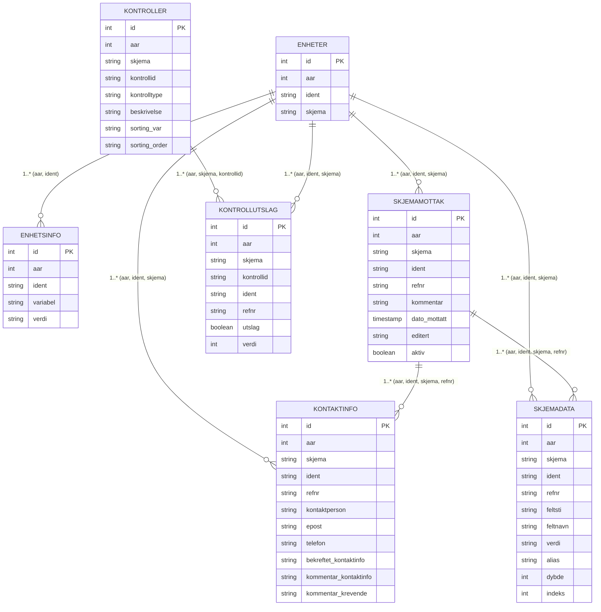

# Data Models
## Pydantic Domain Models
Form-level and structural types:
- FormReception — submission metadata
- ContactInfo — contact person metadata
- Unit — reporting unit
- UnitInfo — unit-level attributes
- FormNode / FormData — field-level extracted entries
- FormJsonData — supplemental JSON metadata
- ExtractedForm — fully combined extraction product

## SQLAlchemy ORM Models
(Defined in schema.py)

- kontaktinfo
- enheter
- enhetsinfo
- skjemamottak
- skjemadata
- kontroller
- kontrollutslag

Relationship logic is based on composite keys like (aar, ident, skjema, refnr).
Entity–Relationship Diagram

