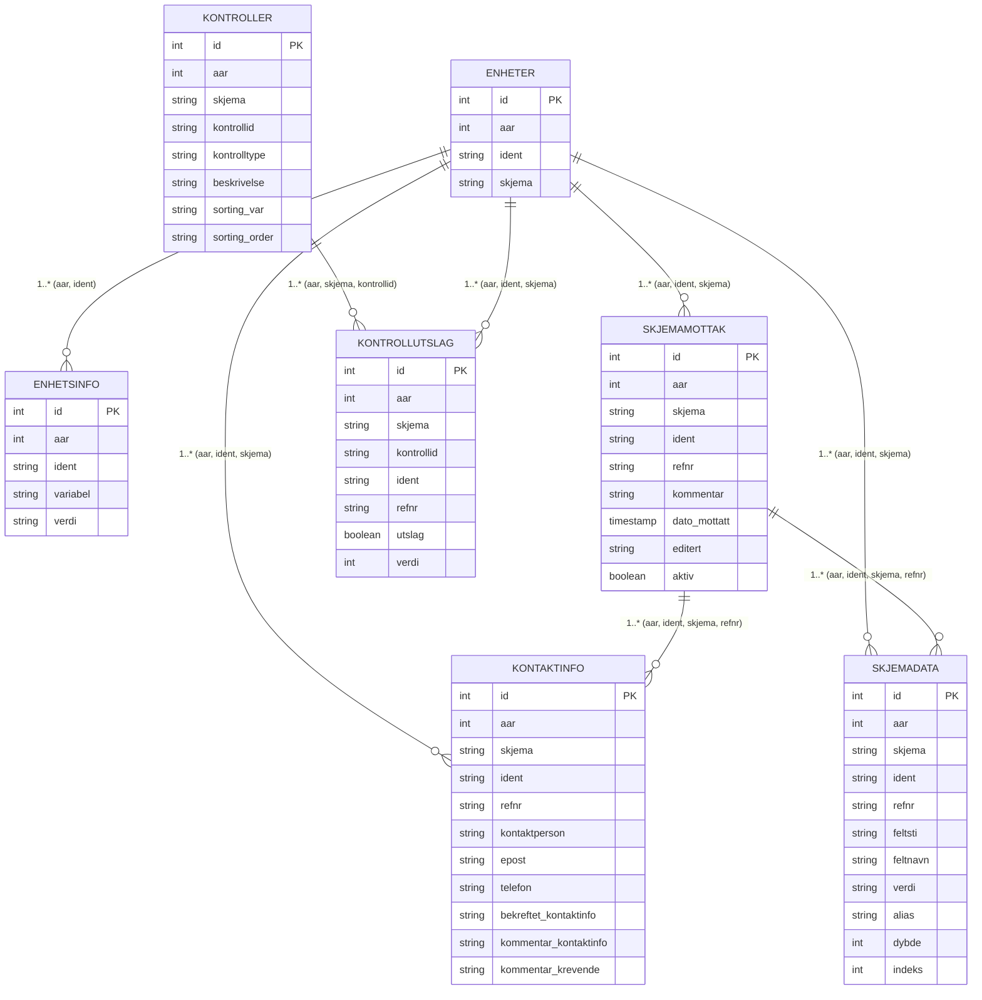

# Form Processing Pipeline
A small, extensible framework for ingesting XML forms, extracting structured models using Pydantic, and persisting them via pluggable storage connectors (SQLAlchemy database today, Parquet WIP). The project uses Google‑style docstrings throughout for consistent documentation.

## Table of Contents

- overview
- key-features
- architecture
    - extraction-layer
    - processing-layer
    - storage-layer
- data-models
    - pydantic-domain-models
    - sqlalchemy-orm-models
    - entityrelationship-diagram
- workflow
- getting-started
    - requirements
    - installation
    - configuration
- usage
    - instantiate-the-default-processor-sqlalchemy
    - implement-your-own-extractor
    - run-processing
- error-handling--transactions
- logging
- conventions
- extensibility
- roadmap
- license


# Overview
This project processes XML form files from a filesystem, normalizes them into typed Pydantic models, and stores the results using a storage connector. It supports:

- Parsing XML with xmltodict.
- Mapping entries into structured models like FormReception, ContactInfo, Unit, UnitInfo, and FormData.
- Transactional storage using SQLAlchemy.
- Optional aliasing and normalization for checkbox-style fields.

The processing workflow is orchestrated by DefaultFormProcessor.

# Key Features

- 🧩 Typed Extraction using Pydantic models
- 🔌 Pluggable Storage Connectors via MetaStorageConnector
- 🔄 Transactional Safety (begin/commit/rollback)
- 🔁 Idempotent Insertions via validate_form_is_new
- ✨ Alias mapping & checkbox normalization
- 📘 Consistent Google‑style documentation


# Architecture
## Extraction Layer

- MetaFormExtractor defines the contract for turning raw XML-derived data (InputFormType) into:
    - ContactInfo
    - FormReception
    - Unit
    - UnitInfo
    - FormData (list)


- Implementors override:
    - extract_contact_info
    - extract_form_data
    - extract_form_reception
    - extract_unit_info

- extract_form orchestrates creation of a complete ExtractedForm.

## Processing Layer
- MetaFormProcessor defines the processing pipeline.
- DefaultFormProcessor:
    - Discovers XML files
    - Parses XML into dictionaries
    - Extracts structured models
    - Applies alias/checkbox transforms
    - Persists everything via MetaStorageConnector

## Storage Layer
- MetaStorageConnector defines transaction and insert methods.
- SqlAlchemyStorageConnector: Full production implementation.
- ParqueditStorageConnector: Work-in-progress file-based connector.


# Data Models
## Pydantic Domain Models
Form-level and structural types:
- FormReception — submission metadata
- ContactInfo — contact person metadata
- Unit — reporting unit
- UnitInfo — unit-level attributes
- FormNode / FormData — field-level extracted entries
- FormJsonData — supplemental JSON metadata
- ExtractedForm — fully combined extraction product

## SQLAlchemy ORM Models
(Defined in schema.py)

- kontaktinfo
- enheter
- enhetsinfo
- skjemamottak
- skjemadata
- kontroller
- kontrollutslag

Relationship logic is based on composite keys like (aar, ident, skjema, refnr).
Entity–Relationship Diagram

# Workflow

1. Discover XML forms under the base path
2. Parse each XML file into a dictionary
3. Extract structured form sections via a MetaFormExtractor
4. Apply transformations (aliasing, checkbox parsing)
5. Persist all sections in a single transaction
6. Skip forms already stored based on reference number


# Getting Started
## Requirements

- Python 3.11+
- pydantic
- sqlalchemy
- xmltodict
- DB driver (SQLite, Postgres, etc.)

## Installation
```Shell
pip install -r requirements.txt
```

## Configuration

- form_base_path: Directory with XML and meta JSON files
- form_name: Used to generate the XML root key A3_{form_name}_M
- alias_mapping: Optional dict mapping raw field names → aliases
- checkbox_vars: Optional list of fields to split into JSON arrays

# Usage
Instantiate the Default Processor (SQLAlchemy)
```Python
engine = create_engine("sqlite:///forms.db")
storage = SqlAlchemyStorageConnector(engine)

extractor = MyExtractor()  # implements MetaFormExtractor

processor = DefaultFormProcessor(
    form_name="A123",
    form_base_path="/path/to/forms",
    extractor=extractor,
    connector=storage,
    alias_mapping={"FieldX": "alias_x"},
    checkbox_vars=["MultiChoiceField"],
)

processor.process_new_forms()
```

## Implement Your Own Extractor
```python 
class MyExtractor(MetaFormExtractor):
    def extract_contact_info(...): ...
    def extract_form_data(...): ...
    def extract_form_reception(...): ...
    def extract_unit_info(...): ...
```

## Run Processing
Call:
```python 
processor.process_new_forms()
```
# Error Handling & Transactions

- Insertions are wrapped in:

```begin_transaction → insert → commit```

- Any exception results in rollback
- Idempotency enforced through ```validate_form_is_new(refnr)```


# Logging

- info: inserted/skipped form
- warning: no forms found
- debug: extracted form data
- error: rollback occurred


# Conventions
- Google‑style docstrings
- Pydantic models use validation_alias
- Pretty‑print JSON in ```__str__```
- SQLAlchemy schema matches extracted Pydantic models


# Extensibility
You can extend:

- Extractors → support alternative XML/JSON schemas
- Processors → different discovery pipelines
- Storage connectors → Parquet, S3, message queue, etc.


# Roadmap

- Full Parquet/Delta backend
- Composite keys and optional foreign keys
- CLI runner
- Test suite and fixtures
- Auto‑generated docs (Sphinx/MkDocs)

# License
Add your license here (e.g., MIT, Apache 2.0).